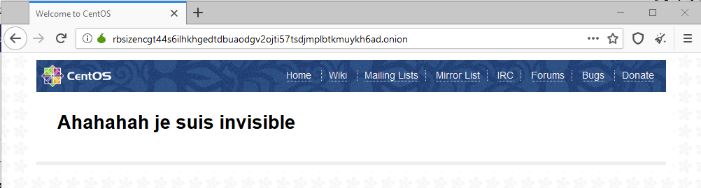
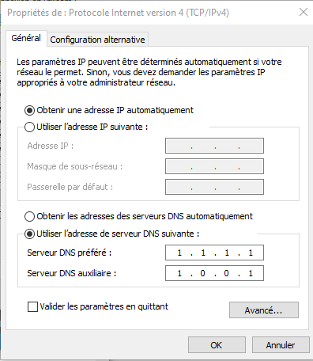
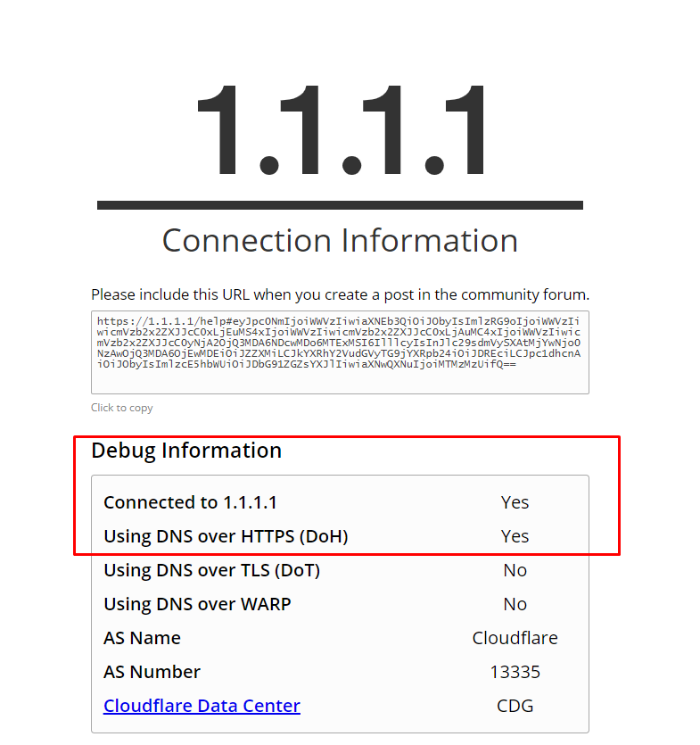

# L'anonymat en ligne #

# Introduction #

>Aujourd'hui la plupart des personnes passe presque 5h sur leurs écrans, dont 1 heure à faire des recherches sur internet, l'idée de ce tp sera donc de comparer l'ensemble des technologies permettant de devenir "Invisible" sur les moteurs de recherche.

# Sommaire : #

1. Le Client Tor
2. Hidden Service Tor
3. Le Proxy
4. DoH / DoT

# 1 - Le Client Tor #

## 1.1 - Qu'est-ce que c'est #

Tor est un client téléchargeable gratuitement, qui permettrait l'anonymat. Créé par la marine américaine en 1990. Tor isole chaque site web dans le but que personne puisse vous suivre, ou regarder votre connexion. Tor aide l'utilisateur à être le plus invisible possible, il efface les cookies et permet d'acceder au site initialement bloquer par le service internet.

## 1.2 - Comment l'installer #

L'installation de Tor est relativement simple, il suffit de se rendre sur le site officiel.

```
https://www.torproject.org/
```

Et d'y télécharger le client, l'installation est plutôt simple elle aussi. Une fois le client installer tor devient utilisable et se présente comme n'importe quel navigateur web.

# 1.3 - Information  #
Tor fonctione en décentralisant tout son réseau, lorsque vous faites une recherche votre connexion passe par celle d'autres personnes acceptant de faire partie du réseau.C'est cette structure décentralisé qui permet au réseau d'être quasi intouchable.
Lorsqu'on utilise wireshark avec tor on remarque que notre ip de destination et du client change constamment.
Deplus les données sont chiffrés.

# 1.4 - Avantage # 

Tor comme vu plus haut permet permet un anonymat presque total, et reste plus simple d'installation.

# 1.5 - Inconvénient #

Les inconvénients de Tor existe pourtant le premier c'est qu'il est conseiller d'utiliser un vpn ou l'hidden service de tor protége les données sur le dernier noeud de sortie, et le second est que le client est trés lent, comme la connexion passe par divers relais.

# 2 - Hidden Service Tor #

## 2.1 - Qu'est-ce que c'est #

L'hidden service est va nous permettre d'avantages de protection avec nos navigation avec tor, mais aussi d'être encore plus anonyme. L'Hidden service nous permettra de "rajouter" un septième noeud à notre service de tor initial rendant irrécupérable les données en sortie.

## 2.2 - Comment l'installer #
Pour cela il nous faudra une VM centOs et virtual box. Pour l'installation rien de plus simple (Suiver la doc de léo).
Premièrement il faudra mettre vos dépos à jours.
```
$ sudo yum install -y epel-release
$ sudo yum update -y 
```
Ensuite il faudra installer le serveur web de tor : 
```
$ sudo yum install -y nginx tor
```
Puis il faudra moditier la page d'accueil NGNInx dans /usr/share/nginx/html/index.html
Pour ma part j'ai juste changer le h1.
Ensuite démarrons le serveur : 
```
$ sudo systemctl enable --now nginx
```
Maintenant il va falloir ajouter un hidden service dans /etc/tor/torrc, et il suffira d'enlever les # devant les lignes :
```
HiddenServiceDir /var/lib/tor/hidden_service/
HiddenServicePort 80 127.0.0.1:80
```
Il suffira maintenant de démarré le service :

```
$ sudo systemctl restart tor
$ sudo systemctl enable tor

```
Et de récupoéré l'adresse du site :
```
$ sudo cat /var/lib/tor/hidden_service/hostname
```
La mienne est 
```
http://rbsizencgt44s6ilhkhgedtdbuaodgv2ojti57tsdjmplbtkmuykh6ad.onion/
```


# 1.3 - Information  #
On remarquera qu'avec l'Hidden service, le dernier noeud de notre chaine est le site onion, cela permet une certaine protection en bout de chaine.On remarque qu'avec Wireshark que la dernier ip du noeud est celle de la vm.

# 1.4 - Avantage #

L'installation est plutôt facile, et cela permet un annonymat complet, l'hidden service agit presque comme un VPN.

# 1.5 - Inconvéniant #
Les recherches sont toujours trés longue, et cela n'accélére pas celle-ci.

# 3 - Le Proxy # 
## 3.1 - Qu'est-ce que c'est #
> Le proxy c'est un serveur, lorsqu'on fait une recherche notre ordinateur va se connecter au proxy et le proxy va faire la recherche à notre place.Le proxy à ca propre ip.

## 3.2 - Comment l'installer #

Normalement chaque fourniseur d'accés possède un proxy, il suffit de se renseigner sur l'addresse de celui-ci et son port, pour ma part il s'agit de Numericable et du port 8080.
Une fois ces informations obtenue il suffit de me rendre dans les paramètres de mon pc et de configuré manuellement le proxy.

# 3.3 - Information  #

Lorsqu'on utilise Wireshark pour écouter, on remarque que les requêtes sont toutes renvoyer vers l'IP du proxy et non pas celle du site demander.

# 3.4 - Avantage #
Le proxy permet d'interdire les ordinateurs d'internet de venir se connecter au votre, en fonction du proxy que vous utiliser certains peuvent vous permettre de masquer certaines informations complémentaire ( Os, moteur de recherche). La géolocalisation est aussi compliqué.
# 3.5 - Inconvénient #
Le soucis du proxy est qu'il utilise un service externe que vous ne pouvez gérez, toutes mes informations passe maintenant par numéricable et ceci pourais trés bien récupéré mes données de connexion.

# 4 - Doh / Dot :

## 4.1 - Qu'est-ce que c'est #
Ces technologies permettent de chiffrer les données, afin de permettre une confidentialité lors de l'accession à certaines données. Par exemple quand je cherche à obtenir du contenue html sur un server et que la connection a se serveur se fait via d'autres serveurs le Doh me permettra de sécurisé l'accés à se code html sans permettre la modification par les serveurs de relais.
# 4.2 - Comment ca s'install #

L'installation est différente selon le moteur de recherche, nous allons prendre dans le cas de google chrome.

Pour installer le DoH sur chrome il va falloir vous rendre sur cette adresse : 
```
chrome://flags/#dns-over-https
```
Une fois sur ce site 
chercher le Secure DNS lookups est activé le.

Une fois chose faite il faudras vous rendre dans les paramétres de votre IPV4 et changer l'adresse DNS du serveur utilisé.


Une fois chose faite il faut se rendre sur ce site :
```
https://1.1.1.1/help
```
Et il faut que le résultat soit celui-ci :



# 4.3 - Information  #

Avec Wireshark on peut voir que mes données sont chiffrés, et que cela rend imposible la lecture des informations.

# 4.4 - Avantage #
L'avantage du Doh c'est que cette technologie permet un véritable chiffrement des données et évite leurs modifications par une personne autre que l'utilisateur.
# 4.4 - Inconvénient  #
L'inconvénient de Doh, dot est qu'il utilise à outrance HTTPS, il faut tout passer par cela, certains sites peuvent bloquer l'accés.